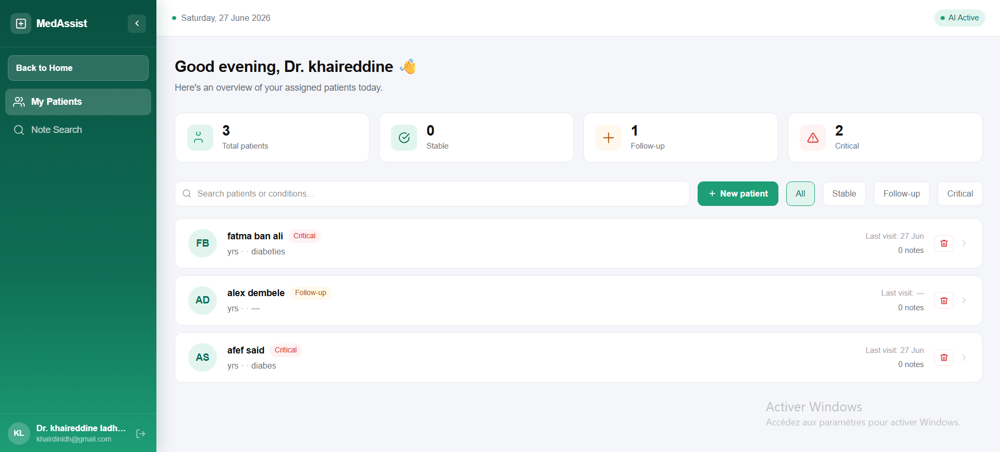
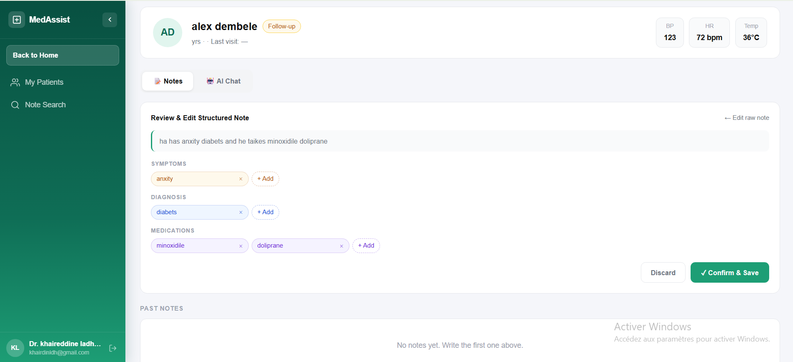
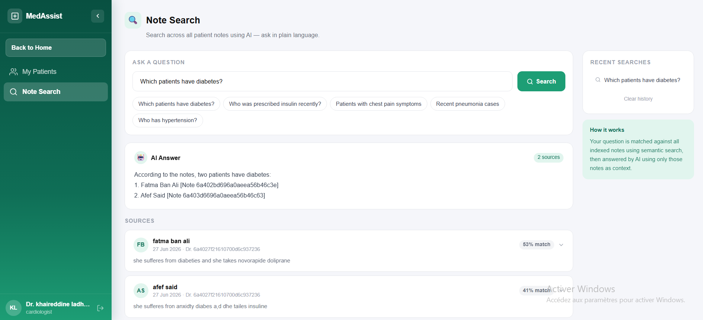

# MedAssist 🏥


> Multi-agent AI system for hospital management — RAG-powered note search, clinical note structuring with ICD-10 lookup, and patient AI chat. Built with React, Node.js, and Groq LLaMA 3.3 70B.

---

## 📸 Screenshots

<p align="center">
  
  <br/><em>Doctor Dashboard</em>
</p>

<p align="center">
  
  <br/><em>Patient Detail & MedAI Chat</em>
</p>

<p align="center">
  
  <br/><em>Note Structuring & RAG Search</em>
</p>

---

## 🧠 AI Features

| Agent | What it does |
|---|---|
| **MedAI Chat** | Answers clinical questions about a patient with grounded responses + prompt injection protection |
| **Note Structuring** | Free-text notes → structured symptoms / diagnosis / medications + real ICD-10 code via NLM API |
| **RAG Search** | Semantic search across doctor notes using Pinecone + `all-MiniLM-L6-v2` + LLaMA as reader |
| **FAQ Agent** | Intent-aware routing — doctor schedules vs general hospital info |

---

## 🛠️ Tech Stack

| Layer | Tech |
|---|---|
| Frontend | React, TypeScript, Tailwind CSS |
| Backend | Node.js, Express, MongoDB, Passport JWT |
| AI Services | Python, Flask (4 microservices) |
| LLM | Groq — LLaMA 3.3 70B |
| Embeddings | SentenceTransformers `all-MiniLM-L6-v2` |
| Vector DB | Pinecone (serverless) |
| ICD-10 | NLM Clinical Tables API |
| Security | Helmet, rate limiting, sanitize-html, prompt injection guards |

---

## 🏗️ Architecture

```
Frontend (React/TS)
        │
        ▼
Node.js / Express API ────── MongoDB
        │
        ├──▶ patient_status.py  :5001  — Patient AI chat
        ├──▶ diagnostics.py     :5002  — Note structuring + ICD-10
        ├──▶ agent_faq.py       :5003  — Hospital FAQ agent
        └──▶ rag.py             :5004  — RAG note search
```

---

## 🚀 Getting Started

### Backend (Node.js)
```bash
cd backend
npm install
cp .env.example .env
node server_of_ai.js
```

### AI Services (Python)
```bash
cd backend_ai
pip install -r requirements.txt
cp .env.example .env
python patient_status.py &
python diagnostics.py &
python agent_faq.py &
python rag.py
```

### Frontend
```bash
cd frontend/frontend_proj
npm install
cp .env.example .env
npm run dev
```

---

## 🔑 Environment Variables

**backend/.env**
```
MONGO_URI=
JWT_SECRET=
CLIENT_URL=http://localhost:5173
```

**backend_ai/.env**
```
GROQ_API_KEY=
PINECONE_API_KEY=
PINECONE_INDEX=doctor-notes
```

**frontend/.env**
```
VITE_API_URL=http://localhost:5000
```

---

## ⚠️ Disclaimer
MedAssist is a portfolio project. AI-generated clinical opinions are not a substitute for professional medical judgment.
